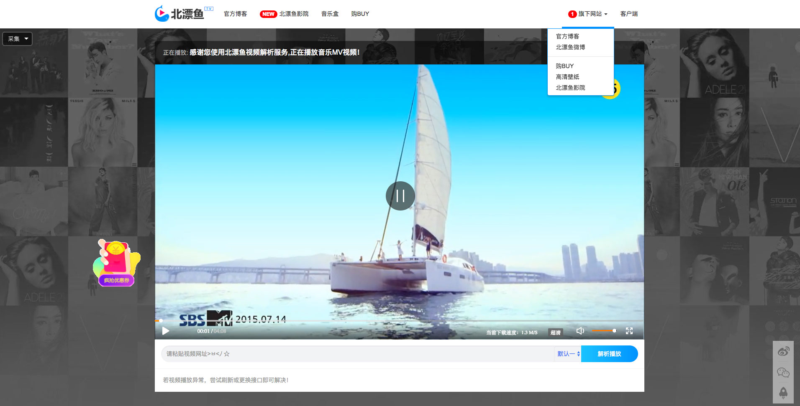

VipVideoResolution北漂鱼Vip视频解析
========
VipVideoResolution是一款开源视频播放框架。具有切换接口、自适应手机端、和后台更改接口、以及聊天插件同步等功能。

前端界面Beipy自供自给进行设计布局，同时采用了流行的响应式设计，无论是在PC端还是在手机端，均能给您带来舒适的使用体验。

#### 运行环境
php 5.4+

#### 版权
本播放器由 [beipy(http://beipy.com)](http://beipy.com) 开发，您可以随意修改、使用、转载。使用或转载时`请务必保留出处`，抱拳了各位老铁们！

### 界面欣赏
-----

在线演示：http://tv.beipy.com 
#### 采用的开源模块
- **Jquery**：js主流开发框架 [http://jquery.com/](http://jquery.com/)
- **Bootstrap**：主流响应式CSS框架[http://www.bootcss.com/](http://www.bootcss.com/)

### 更新日志
-----

#### v2.1 `2018/2/24`
- 修复配置文件出错；
- 新增浏览器标题栏显示相关信息
- 一些细节的完善

#### v2.0 `2018/2/20`
- 修复功能 视频状态全屏；
- 修复某些手机浏览器列表页

#### v0.1 `2017/11/12`
- 新增php 获取url地址的title标题， ；
- 修改手机适配
- 去除多余ico图标 
- 手机版ui美化

