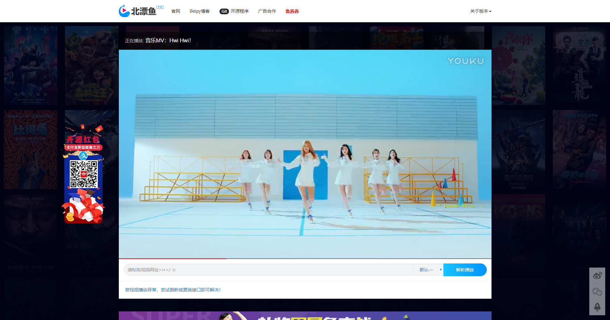
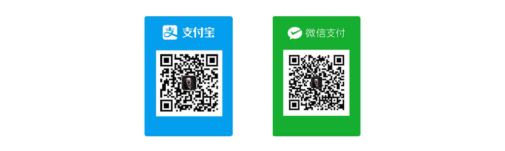

BeipyVideoResolution
========

  
  
  
  

## 最后声明永久不再维护此项目，最终截止V2.6版本

BeipyVideoResolution是一款开源视频播放框架。具有切换接口、自适应手机端、和后台更改接口、以及聊天插件同步等功能。

前端界面Beipy自供自给进行设计布局，同时采用了流行的响应式设计，无论是在PC端还是在手机端，均能给您带来舒适的使用体验。

#### 程序相关配置
安装后为了安全，请自行更改后台目录位置文件夹名称！

- 在线演示：[http://tv.beipy.com](http://tv.beipy.com)
- 默认后台管理页面 `/admin`；
- 默认后台账号：beipy  
- 默认后台密码：beipy.com

#### 运行环境
PHP 5.4+ （使用前请检查服务器运行环境是否低于5.4，否则会出现后台保存自动转义添加斜杠问题。）

#### 版权

本源码由 [beipy(http://beipy.com)](http://beipy.com) 开发，您可以随意修改、使用、转载。使用或转载时`请务必保留开发版权`！

**版权保留位置：** Html注释版权，以及Console调试输出版权，以及主页底部版权声明。

如发现修改版权的人或单位一单被永久记入本人黑名单！  

**如发现有修改版权的请与本人反馈，在此谢过！📮Email:<beipy0@163.com>**

-----
#### 版权耻辱
以下个人以及单位私自更改作者版权，永久进入本人的黑名单！

`奉劝某些“人”保留住做人的最基本底线，遵守开源协议，并引以为戒`

- **送码网 [[ https://www.songma.com ](https://www.songma.com)]** 原因：未经本人允许进行非法售卖！
- **我爱分享网 [[ https://vip.fxw.la ](http://vip.fxw.la)]** 原因：更改版权，去除本站开发版权！
- **蓝天 [[ http://wwpw.top/ ](http://wwpw.top)]** 原因：更改版权，去除本站开发版权！
- **蓝海 [[ http://lanhaitv.com/ ](http://lanhaitv.com/)]** 原因：更改版权，去除本站开发版权！
- **Anymore's Vip解析 [[ http://zzxzz.cn/ ](http://zzxzz.cn/)]** 原因：更改版权，去除本站开发版权！
- **[[ http://www.386life.com/ ](http://www.386life.com/)]** 原因：更改版权，去除本站开发版权！

### 界面欣赏
-----

### 打赏
-----
- **支持项目继续完善下去，你也可以贡献一份力量！💰打赏，更会有更新的动力！

- `也可以支付宝扫码红包来赠送微薄之力！`

### 更新日志
-----

#### v2.6 `2019/2/25`
- 更新界面UI
- 去除畅言插件广告，美化评论框；
- 更新后台设置保存错误问题；
- 修复广告位置；
- 修正链接错误；
- 更新视频网站Logo列表；

#### v2.5 `2019/2/23`
- 修复CURLOPT_FOLLOWLOCATION报错；
- 调整后台细节信息；
- 新增页脚Footer版本号；

#### v2.3 `2018/7/15`
- 构建加密通道；
- 加密信息版权；

#### v2.2 `2018/6/21`
- 修复导航菜单下顶菜单；
- 新增导航栏跟随页面
- 修复获取视频标题错误问题。

#### v2.1 `2018/2/24`
- 修复配置文件出错；
- 新增浏览器标题栏显示相关信息
- 一些细节的完善

#### v2.0 `2018/2/20`
- 修复功能 视频状态全屏；
- 修复某些手机浏览器列表页

#### v0.1 `2017/11/12`
- 新增php 获取url地址的title标题， ；
- 修改手机适配
- 去除多余ico图标 
- 手机版ui美化
